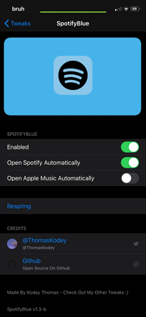

# Adding Cephei Preferences

So what exactly is [`Cephei`](https://hbang.github.io/libcephei/index.html) and what are its benefits

`Cephei` is a framework for your device its created for developers to make certain things easier
For example `PreferenceBundles` (The settings page for your tweak)

> Cephei is supported on every version of iOS since 5.0, on every device. So don't worry about compatibility

 Chances are you have a tweak that already uses it, as it is a powerful framework and makes our lives way easier

# What exactly does it do?

Our main use of `Cephei` is `CepheiPrefs` which we can use to make our preferences look amazing and create them easily

# Integrating Cephei Preferences into our tweak

In this guide we will start from scratch and without any existing `PreferenceBundle` for our tweak

The end result of this guide will be a `PreferenceBundle` that looks a little something like this




> Please note: This guide will be teaching the specifics of Cephei PreferenceBundles not PreferenceBundles in general,
> to get a better idea of how PreferenceBundles work in general please read the `Adding A PreferenceBundle ` tutorial

So generate a `PreferenceBundle` using `Theos` the usual way, then add to your `makefile`

```makefile
$(TWEAK_NAME)_EXTRA_FRAMEWORKS += Cephei
```

and now let's go to your `control` file and lets add `Cephei` as a dependency

Too add a dependency we need to add a comma after our last dependency then put in the `BundleID` of our dependency

For example for `Cephei`

```UTF-8
Depends: mobilesubstrate, ws.hbang.common (>= 1.15.1)
```

> Please note at the time of writing Cephei is on version 1.15.1

This is telling `Cydia` or our `Package Installer` that we also need to install `Cephei` and it will do that automatically for our end-user

We have now finished installing `Cephei` in our main folder

Lets go into our `PreferenceBundle` folder (The folder `theos` creates)

Now we need to add this too our `makefile`

```makefile
$(BUNDLE_NAME)_EXTRA_FRAMEWORKS += Cephei CepheiPrefs
```

Now in our `XXXRootListControler.h`
> 'XXXRootListControler.h' is a placeholder name for the three digit unique identifier that we inputted when we created our PreferenceBundle

```objective-c
#import <CepheiPrefs/HBRootListController.h>
#import <Cephei/HBRespringController.h>
```

The second import isn't vital but it adds a cool feature where we can press a button to respring

Cool, so we now have `Cephei` successfully imported. Let's start using it

# How to use Cephei

Cephei is now essentially 'Plug and Play' it incorporates incredibly easily into our `PreferenceBundle`

It adds some features which makes our `Preferences` look amazing

All we have to do is add them to our `Root.plist` just like any other `PreferenceBundle` cell

Im just going to list a few and how we extract the values of switches from our `Preferences` and have it do stuff in our tweak

All Documentation on all the different features of `Cephei` can be found [HERE](https://hbang.github.io/libcephei/index.html)


# PostNotification / ReloadPrefs

This is a handy feature that allows us to refresh our `PreferenceBundle` values without a respring

This MUST be added under every `cell` you would like this feature to be present on (such as switches)


```plist
<key>PostNotification</key>
<string>com.bundleID.somethingPrefs/ReloadPrefs</string>
```

> Please note com.bundleID.somethingPrefs needs to be replaced with the bundleID of our preferences, this can be found in `info.plist` under `CFBundleIdentifier`

# HBRespringController

This can be used as an action for a button to respring our device

```plist
<key>action</key>
<string>respring</string>
```

Now we need to create a method called respring in our `XXXRootListControler.m`

```objective-c
-(void)respring {
  [HBRespringController respring];
}
```

Now whenever we press the button whose assigned `action` is `respring` it shall respring our device

# HBImageTabelCell

This can import an image into our preferences, for example as a header or a footer

It can also just be used to import an image into our `Preferences` as a `cell`

```plist
<!-- As a header (or footer): -->
<dict>
    <key>cell</key>
    <string>PSGroupCell</string>
    <key>headerCellClass</key>
    <string>HBImageTableCell</string>
    <key>height</key>
    <integer>100</integer>
    <key>icon</key>
    <string>image.png</string>
</dict>

<!-- As a cell: -->
<dict>
    <key>cellClass</key>
    <string>HBImageTableCell</string>
    <key>height</key>
    <integer>100</integer>
    <key>icon</key>
    <string>image.png</string>
</dict>
```

Just add them to your `root.plist` and they should display your chosen image
> Please note that the image needs to be stored in the directory of `root.plist`

# HBLinkTableCell

This can create a button that when pressed opens a `URL` to whatever website we want
You can also attach an image next to it, making it ideal for a 'Source Code On Github' button

```plist
<!-- With icon: -->
<dict>
    <key>cellClass</key>
    <string>HBLinkTableCell</string>
    <key>icon</key>
    <string>example.png</string>
    <key>label</key>
    <string>Example</string>
    <key>url</key>
    <string>http://example.com/</string>
</dict>

<!-- With initials: -->
<dict>
    <key>cellClass</key>
    <string>HBLinkTableCell</string>
    <key>initials</key>
    <string>XX</string>
    <key>label</key>
    <string>Example</string>
    <key>url</key>
    <string>http://example.com/</string>
</dict>
```

`HBLinkTableCell` only requires a `URL` and a `label` to function, other parameters are optional

# HBTwitterCell

This is personally my favourite as I will plug my twitter ([@ThomasKodey](https://twitter.com/ThomasKodey)) at any given moment

It automatically shows the Profile Picture of the person but this can be disabled by using the parameter `showAvatar`

```plist
<dict>
    <key>cellClass</key>
    <string>HBTwitterCell</string>
    <key>label</key>
    <string>Follow My Twitter</string>
    <key>user</key>
    <string>ThomasKodey</string>
</dict>
```

# Extracting values from our Preferences and using them in our tweak

`Cephei` again makes it incredibly easy to extract our `Preferences` and use them in our tweak

First we need to add `CepheiPrefs`'s `HBPreferences.h` header to our tweak

```objective-c
#import <Cephei/HBPreferences.h>
```

Then all we need to do is create an `instance` with our `PreferenceBundle`'s bundleID

The following code i recommend to place at the bottom of our `Tweak.x` file so it is easy to refer too

```objective-c
%ctor {

  HBPreferences *preferences = [[HBPreferences alloc] initWithIdentifier:@"bundleID"];

}
```

> Replace bundleID with the bundleID of our `PreferenceBundle`

Then to extract variables such as if a switch is on or off we want to add this into our `%ctor`;

```objective-c
[preferences registerBool:&variableName default:YES forKey:@"keyIdentifier"];
```

`registerBool` - Please change this depending on our variable type
`variableName` - Please change this to the variable you want our value to be stored in
'keyIdentifier' - Please change this to the keyIdentifier we set for our switch or other item

Then make sure to declare that variable before we use it

```objective-c
BOOL variableName;
```

So now if we wanted to do something if our switch is enabled we can just use an `if` statement and it would look something like this

```objective-c
%hook randomClass

-(void)randomMethod {
  if(variableName) {
    // Do something if the switch is enabled
  }
}

%end
```

And that is `Cephei` summed up

Full Documentation for `Cephei` is available [HERE](https://hbang.github.io/libcephei/)
This is not by far the most this framework can do, however this is the basics
