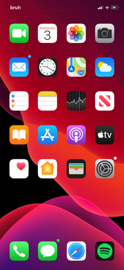

# Tweak Design 101

This section will contain good information too creating a successful tweak that sells well and people like

Ever wonder why some tweaks sell well and others don't

It is all about branding and design

This section of the guide will explain vital concepts to designing a successful tweak

Good Tweak Design is like architecture, there is a reason these guidelines have been created its because they work

# Design Guidelines

Design Guidelines are ideal ideas that a product should follow in order to work well

These in my opinion are some of the best `Design Guidelines`

# Functional Design

[Functional Design](https://www.smashingmagazine.com/2008/08/7-essential-guidelines-for-functional-design/) is the concept of designing something to just function

Your tweak just simply needs to work, it needs to be functional. Here are a few things to consider

- It needs to come out the box with `little to no` setup, it should just work
- Any User Interfaces need to be simplistic and someone who has never seen the tweak before should be able to work it
- Simplicity, don't just add random buttons for the sake of `customisability`

# Human Interface Guidelines

This `Design Spec.` is from Apple and can be found [HERE](https://developer.apple.com/design/human-interface-guidelines/)

This is one of my favourite specifications as Apple is renounced for there amazing design

Your design should be fluid and clear yet simple and easy to use

The reason Apple is so good at design is because they have consistent themes that look fluid and are never cluttered

Have you ever heard anyone say they brought an iPhone because it just worked... their design is so good it just works

You are going to want to make your tweak feel like a part of your phone, like it was meant to be there anyway

An amazing example of this is some of the work [Maxwell Dausch](https://repo.daus.ch) has done
His tweaks feel like a part of the phone and the user experience

Another example of this is [ConorTheDev's](https://twitter.com/ConorTheDev) dotto+ the tweak looks right at home with Apple's UI

# Branding

We live in the digital age, where it is hard to make a name for yourself
In the age of consumerism we live in branding is ever more important

We want too give people a reason to buy our tweak or to download it, why should they use our tweak

Nobody is going to use our tweak if it doesn't have branding. If you see a tweak without a logo you are way less likely too download it

We also want good screenshots to sell to our audience that our tweak is professional and will perform the task needed

50% of our tweak is branding the other 50% is the functionality of the tweak, If we brand our tweak correctly it will be way easier to sell it too people

# Social Media

Social Media is our friend, a brilliant way to get our tweak out there is promoting it via social media
There is an incredibly high chance that you found this guide via social media it was either sent too you by someone or you found it, either way you can tell it is a powerful tool

To market our tweaks we can use [Reddit](https://reddit.com/r/jailbreak), there are 500k people on [r/jailbreak](https://reddit.com/r/jailbreak) thats a massive audience that we can promote too for free

Remember if your tweak doesn't follow good design guidelines then it won't be successful - there are a reason people use these guidelines half the time they are unintentional

# Good Tweak Design Case Studies

I have listed a few good examples of good tweak design, these follow all the design guidelines and principals i have talked about

# Scorpion

Scorpion is a perfect example of good tweak design, it feels like it fits into Apple's ecosystem. It feels like it fits into the phone by default

The settings work perfectly and look appealing to the user, they follow the principals of good design

As seen here, the UI fits seamlessly into the phone and it just works

The branding for scorpion again is on point, it looks professional but also directly states what it does and shows us examples

# dotto+

dotto+ is an amazing tweak that feels right at home with the default iOS experience, it is functional yet looks good

The branding is also brillant, it shows the consumer exactly what it does and how it does it. It doesn't put function over design but putting them on-par with each other

Once again the settings look nice and are functional, nothing is there that doesn't need to be. There isn't random buttons all over the place for the sake of customisability

# SpotifyBlue

Although SpotifyBlue is my own tweak, i will still talk about what went into designing it. I am not saying it is the best looking tweak but it follows the basic design principals

The branding for SpotifyBlue is clear and concise, the branding is also consistent any logos or headers are reused to create a sense of consistency throughout the tweak

# Summary

In essence good tweak design is as much about the actual UI of the tweak as the functionality, don't skip out on either
