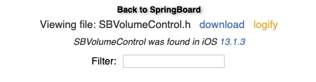

# Headers

In objective-c, `headers` contain our `methods` and as you will remember our `methods` allow us to change and modify code on our device

# What Does A Header Look Like

This is the header for `SBVolumeControl.h` as we found in our previous lesson

```objective-c
#import <SpringBoard/SpringBoard-Structs.h>
#import <libobjc.A.dylib/SBVolumeHUDViewControllerDelegate.h>
#import <libobjc.A.dylib/PTSettingsKeyObserver.h>
#import <libobjc.A.dylib/SBAVSystemControllerCacheObserver.h>

@protocol OS_dispatch_queue;
@class SBHUDController, SBVolumeHUDSettings, SBRingerControl, NSMutableArray, NSMutableSet, NSString, NSObject, SBAVSystemControllerCache, NSArray;

@interface SBVolumeControl : NSObject <SBVolumeHUDViewControllerDelegate, PTSettingsKeyObserver, SBAVSystemControllerCacheObserver> {

+(id)sharedInstance;
+(BOOL)_isVolumeChangeAllowedForState:(id)arg1 error:(out id*)arg2 ;
-(float)_effectiveVolume;
-(void)settings:(id)arg1 changedValueForKey:(id)arg2 ;
-(void)increaseVolume;
-(void)decreaseVolume;
-(void)cancelVolumeEvent;
-(void)handleVolumeButtonWithType:(long long)arg1 down:(BOOL)arg2 ;


...

}

@end
```
> This header file is a lot bigger and the rest of it is hidden for the purpose of the guide. Please remember in practice header files can be massive but they can also be relatively small

So you first impression is probably... what the hell is that. Well the good news is we don't need to worry about the majority of it.

# Exactly How Do We Use them

Well first, the site has a handy button right next to it called `logify` this automatically converts the `header` into `logos` syntax



So if we press that button it will give us this

```objective-c
%hook SBVolumeControl
+(id)sharedInstance { %log; id r = %orig; HBLogDebug(@" = %@", r); return r; }
+(BOOL)_isVolumeChangeAllowedForState:(id)arg1 error:(out id*)arg2  { %log; BOOL r = %orig; HBLogDebug(@" = %d", r); return r; }
-(float)_effectiveVolume { %log; float r = %orig; HBLogDebug(@" = %f", r); return r; }
-(void)settings:(id)arg1 changedValueForKey:(id)arg2  { %log; %orig; }
-(void)increaseVolume { %log; %orig; }
-(void)decreaseVolume { %log; %orig; }
-(void)cancelVolumeEvent { %log; %orig; }
-(void)handleVolumeButtonWithType:(long long)arg1 down:(BOOL)arg2  { %log; %orig; }

...

%end
```
> Again this file is bigger just like the header but is hidden for the sake of the guide

Now this will look a bit more familiar, but again we don't need to worry about most of it

`logify` automatically gives us the correct `hook` and `class` so we don't need to worry about that

So if we have our `hook` and our `class` the only missing thing is our `method`

Lets scroll through the code `logify` has given us and see if anything stands out

```objective-c
-(void)increaseVolume { %log; %orig; }
-(void)decreaseVolume { %log; %orig; }
```

Now these two methods seem like they control volume, which is perfect and exactly what we want.

So lets make the `hook` smaller as we don't need the rest of the methods

```objective-c
%hook SBVolumeControl
-(void)increaseVolume { %log; %orig; }
-(void)decreaseVolume { %log; %orig; }
%end
```

Now thats a lot more manageable, but we can still trim it down a bit, lets format it
So we can read it a lot better

```objective-c

%hook SBVolumeControl

-(void)increaseVolume {
	%log;
	%orig;
}

-(void)decreaseVolume {
	%log;
	%orig;
}

%end
```

If we really wanted to trim it down more we can remove the `%log` as I will show you another method of debugging

```objective-c
%hook SBVolumeControl

-(void)increaseVolume {
	%orig;
}

-(void)decreaseVolume {
	%orig;
}

%end
```

Now thats, way easier to understand. So lets put it together.
