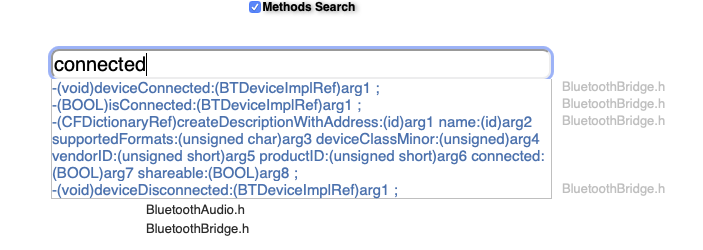

# Adding Private frameworks

Public frameworks are great for the large majority of cases but they don't cover everything.

# Private Vs Public Frameworks

Private Frameworks allow us to access every single feature on our iDevice, for example using `BluetoothManager` framework
too see when a Bluetooth Device connects, however they have a series of Pros and Cons

Pros
- Allows us to modify every single feature on our iDevice

Cons
- Virtually `zero documentation` on them
- Harder to import and use in `theos`

# Actually using them

Importing Private Frameworks in `theos` is relatively easy just like regular frameworks except you do the following

```makefile
$(TWEAK_NAME)_PRIVATE_FRAMEWORKS = aRandomFramework
```

However, even if you are using patched SDK's you cant always guarantee that every PrivateFramework will work.

So we need to be picky in the headers we import as most likely we will have to download them from [Limneos Headers](https://developer.limneos.net/?ios=13.1.3)


For example lets say we wanted to check to see if we are connected to a BluetoothDevice and if we are open an app, for example Spotify

So lets first go onto [Limneos](https://developer.limneos.net/?ios=13.1.3) and search for the framework we want to use.

> Tweak Development is largely about 'trial and improvement'. If one method doesn't work try another one and narrow down our search

Looking through the list of frameworks available to us lets find the ones related to Bluetooth

```UTF-8
BluetoothAudio
BluetoothManager
```

Lets test our method of `trial and improvement` by checking the first framework `BluetoothAudio`

In this framework it consists of 3 `header` files so it is a relatively small framework

```UTF-8
BluetoothAudio-Structs.h
BluetoothAudio.h
BluetoothBridge.h
```

We can use the `Methods Search` function of the site too find a method or variable in a class that holds
if we are connected to a bluetooth device or not.



`-(void)deviceConnected:(BTDeviceImplRef)arg1 ;`
`-(BOOL)isConnected:(BTDeviceImplRef)arg1 ;`

These both look promising, so let's implement them so we can use them in our tweak.

> The key to this is only add what you need

In `BluetoothBridge.h` it calls for the import `BluetoothAudio-Structs.h` so we will first have to copy and paste that into a file in our directory we can call it whatever we want just as long as we refer to it
as that name whenever calling it. For simplicity we will name is `BluetoothAudio-Structs.h`

After that is done we can create our smaller header for `BluetoothBridge.h`

Let's first remove what we don't need from the header, so it should look something like this.

```objective-c
@protocol OS_dispatch_semaphore, OS_dispatch_queue;
#import <BluetoothAudio-Structs.h>
@class NSObject, SFDeviceDiscovery;

@interface BluetoothBridge : NSObject {

	NSObject*<OS_dispatch_semaphore> _connectedSemaphore;
	NSObject*<OS_dispatch_semaphore> _disconnectedSemaphore;
	BOOL _targetUserSession;
	OpaqueFigEndpointManagerRef _manager;
	SFDeviceDiscovery* _deviceDiscovery;
	NSObject*<OS_dispatch_queue> _queue;
	BTSessionImplRef _session;

}

@property (assign,nonatomic) OpaqueFigEndpointManagerRef manager;              //@synthesize manager=_manager - In the implementation block
@property (retain) SFDeviceDiscovery * deviceDiscovery;                        //@synthesize deviceDiscovery=_deviceDiscovery - In the implementation block
@property (assign) BOOL targetUserSession;                                     //@synthesize targetUserSession=_targetUserSession - In the implementation block
@property (retain) NSObject*<OS_dispatch_queue> queue;                         //@synthesize queue=_queue - In the implementation block
@property (assign) BTSessionImplRef session;                                   //@synthesize session=_session - In the implementation block
-(void)deviceConnected:(BTDeviceImplRef)arg1 ;
-(BOOL)isConnected:(BTDeviceImplRef)arg1 ;
%end
```

> Please Remember to change the imports line of your new header to reflect the name in the tweak files

There is still a few things we could remove, however for the sake of the guide we will keep it like this
It is small enough to be managed easily.

# Importing Our Custom headers into our tweak

Just like any other framework we need to import the `headers` into the code

```objective-c
#import <BluetoothBridge.h>
```

And now using `logify` we can find out the class we need to hook into is `%hook BluetoothBridge`
So we can now add the methods too our tweak

```objective-c
%hook BluetoothBridge

-(void)deviceConnected:(BTDeviceImplRef)arg1  {

  // returns original code
  %orig;

  // modified code here

}

-(BOOL)isConnected:(BTDeviceImplRef)arg1  {

  return %orig;

}

%end
```

> Please be aware if using anything other than a (void) method we have to return %orig; instead of %orig;

Also double check you have added the framework you are using in your `makefile`

```makefile
$(TWEAK_NAME)_PRIVATE_FRAMEWORKS = aRandomFramework
```

And ... we are done

It is a little complex, however not impossible 
